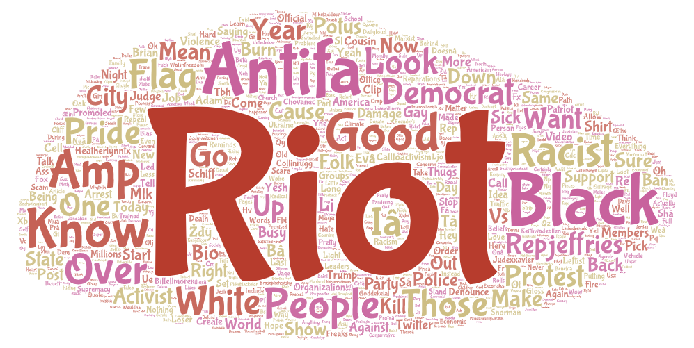

# lab02

#### i. & ii.
I decided to use **BLM** as the parameter to get an overlook of the topic and see what people are discussing about the aftermath of the movement that has erupted during mid-2020. The four locations I chose are _Seattle WA_, _Dallas TX_, _Manhattan_, and _Los Angeles CA_. These four cities each represents a crowd of unique population that differs vastly in culture and geography from the others. To find out if this difference also shows in the twitter threads of a rather political topic such as BLM, and whether the threads reflect the characteristics of each city, I collected the data to make some comparisons. 

#### iii.
As expected, the word clouds share a set of the same phrases that are most common in the discussion of BLM no matter the geographical location (BLM, Riots, Protests, etc.), while words that are less common start to show a unique set of diversity in each word cloud.  
Word clouds of Seattle and LA present a general reflection of the place with locational terms involved. In the word cloud of threads in Manhattan, “Boomer” stands out to be a significant term while it doesn’t seem to appear in the other word clouds. The terms in the Manhattan word clouds overall present a mild temperament and objective tone to the subject. 

While in the Dallas word cloud, political terms such as “Democratic” and “Party” are brought up more than in other word clouds, and more heated words are involved (Thugs, Freaks, Gay). 

#### iv.
The patterns of these word clouds have a strong association to their geographical location in my opinion. They all contain similar set of common words related to BLM, with different levels of temperament and heat. It could be explained that given the nature of the twitter environment, political topics often stir up heated conversations and quarrels, and it depends on the population in each city what kinds of word sets they prefer to use. There is research done by geographers that collects the greeting words people say in different states, and the result shows a great variety which can be used to explain the same variety in these word clouds.

#### v.

#### vi.
One of the things that stood out to me is that the word clouds have the phrase **“Antifa”** as one of the most repeated phrases. At first, I thought it was a typo or a random code, and went ahead to delete it from the words, but as I encountered it multiple times, I decided to look up its meaning and how it relates to BLM. Antifa is an anti-racist political movement that consists of autonomous groups that use both nonviolent and violent action to achieve their aims. [Recent news](https://nypost.com/2023/01/21/protesters-torch-police-car-damage-businesses-in-atlanta-after-activist-killed/) has reported incidents of Antifa holding violent protests and riots, and given the overlap between the two movements’ nature, even though largely different, it stirred up discussions when people got reminded of the BLM movement during 2020 and the protests that occurred, while some defending BLM by distinguishing it from the other. “I don’t see BLM. This is Antifa.” Said one tweet from LA.